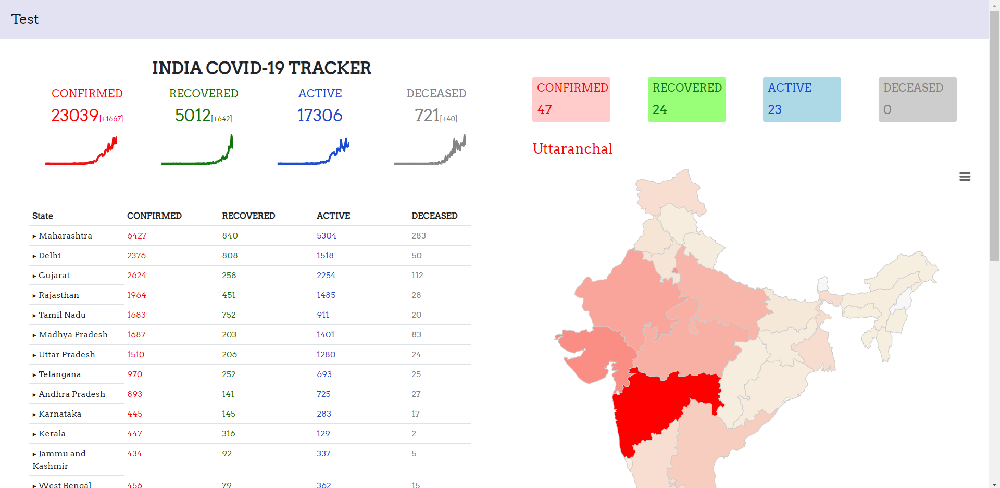
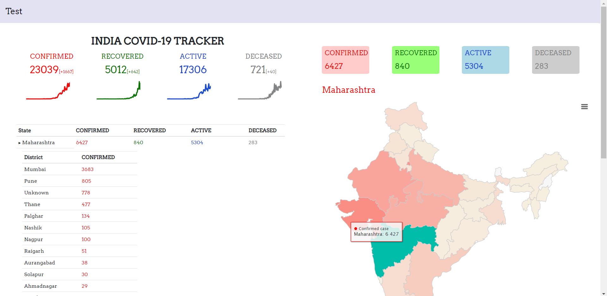

# COVID-19-Tracker

This is not any offical. I have made this application to learn how to integrate Chart.js with Python and create some interactive graphs.
I have used https://api.covid19india.org/ API for getting data. 

All the stats shown in project have used from above API so count mismatch may possible.  

Home page

