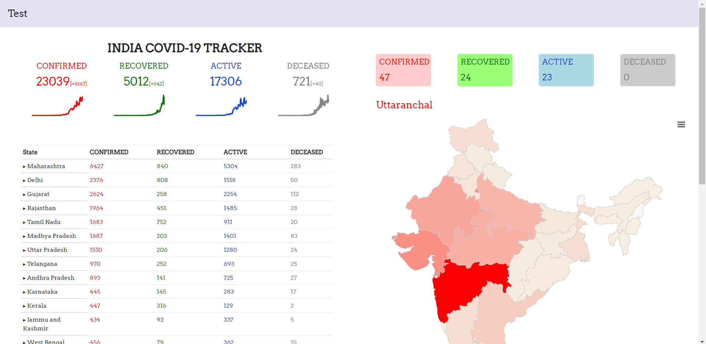

# COVID-19-Tracker

The purpose of the project was to learn about using Chart.JS with Python and how to show data in form of interactive graphs. To get the data I have used 
https://api.covid19india.org/ API.

Home page

